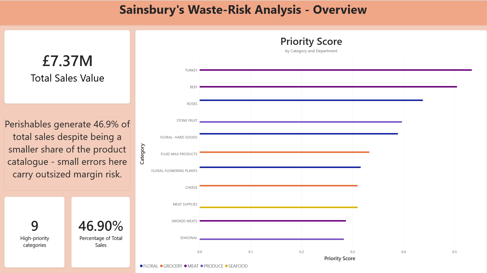
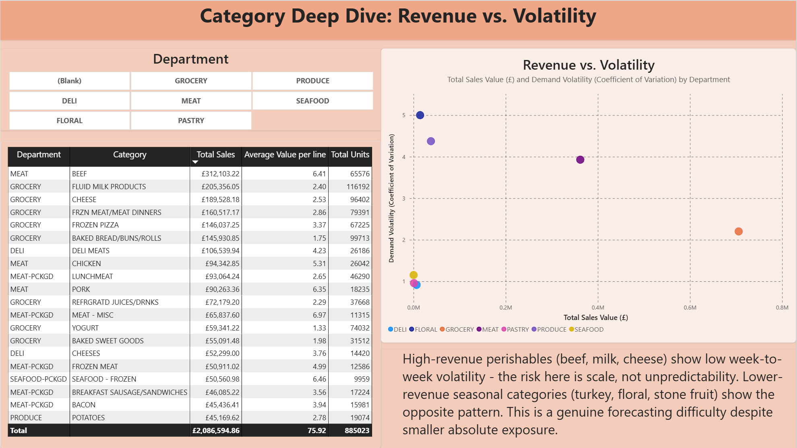
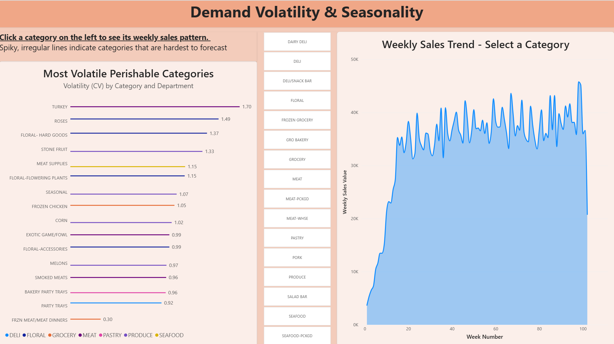
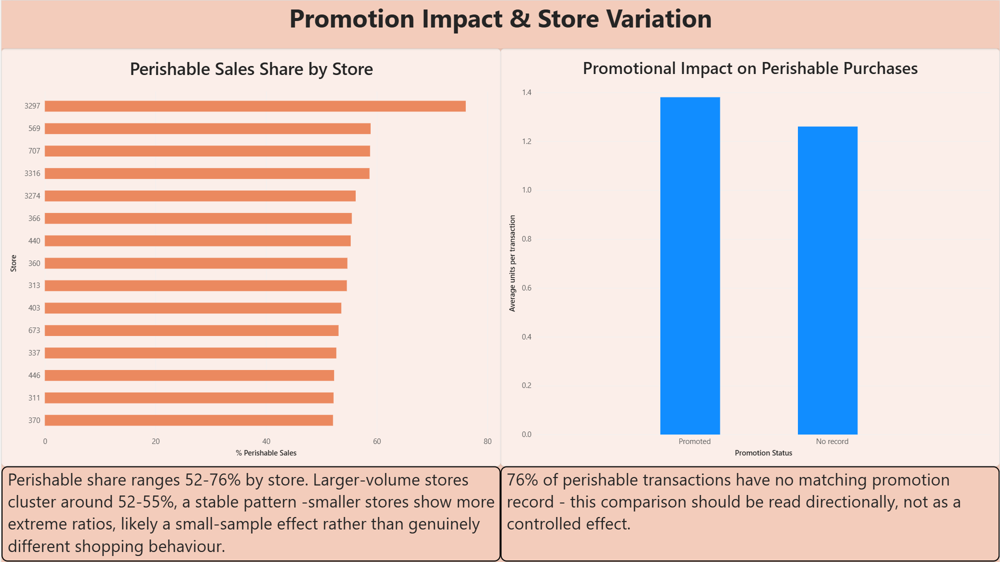

# Sainsbury's-Style Perishable Waste-Risk Analysis

An end-to-end data analytics project identifying which perishable product categories carry the highest waste risk, using a public grocery transactions dataset as a stand-in for Sainsbury's-style retail data.

**[View the insights summary](docs/insights_summary.md)** | **[View the data dictionary](docs/data_dictionary.md)**

---

## The Business Question

> Which perishable products carry the highest waste/overstock risk, and what should category management do differently for each?

Perishable categories generate **46.9%** of total sales value in this dataset despite being a smaller share of the overall product catalog - meaning waste and forecasting errors in these categories carry an outsized impact on margin. This project identifies which categories matter most, and *why* they're risky, since "high revenue" and "hard to forecast" turn out to require different responses.

---

## Key Finding

Combining revenue exposure with week-to-week demand volatility surfaces **two distinct risk profiles**, not one ranked list:

| Risk type | Example categories | What drives the risk | What fixes it |
|---|---|---|---|
| **Volatility-driven** | Turkey, floral, stone fruit | Demand is genuinely hard to predict | Better, occasion-aware forecasting |
| **Scale-driven** | Beef, milk, cheese | Demand is stable, but revenue at stake is huge | Ordering discipline, markdown timing |

Full findings, including promotion effect analysis and store-level variation, are in the [insights summary](docs/insights_summary.md).

---

## Dashboard

4-page Power BI report - built on a star-schema DuckDB database, fully filterable and cross-interactive.

### Page 1: Overview
Headline KPIs and the top 10 waste-risk categories, ranked by a combined revenue + volatility priority score.



### Page 2: Category Deep Dive
Full category breakdown table alongside a revenue-vs-volatility scatter plot, department-filterable - this is where the two risk clusters (scale-driven vs. volatility-driven) become visible at a glance.



### Page 3: Volatility & Seasonality
Most volatile categories, with a clickable weekly-trend line chart that drills into any selected category's seasonal pattern.



### Page 4: Promotion & Store View
Promotion lift on perishable purchases (with an explicit data-coverage caveat) and perishable sales share by store.



---

## Tech Stack

- **Python** (pandas) - data cleaning, ETL
- **DuckDB** - analytical database, star schema
- **SQL** - all analysis queries
- **Power BI** - 4-page interactive dashboard

---

## Project Structure

```
├── data/                    # Raw CSVs (gitignored - not redistributed)
├── docs/
│   ├── data_dictionary.md       # Source table documentation
│   ├── perishable_mapping.md    # Waste-risk classification methodology
│   ├── insights_summary.md      # Stakeholder-style findings & recommendations
│   └── screenshots/             # Dashboard page images (for this README)
├── etl/
│   ├── load.py                  # Builds the star schema DuckDB database
│   ├── run_query.py             # Runs any SQL file against the database
│   └── export_for_dashboard.py  # Exports query results as CSVs for Power BI
├── sql/                     # All analysis queries (8 total)
├── dashboard/
│   ├── data/                    # CSV exports powering the dashboard
│   └── waste_risk_dashboard.pbix
└── notebooks/
    └── explore.ipynb         # Initial data exploration
```

---

## Data

**Source:** [Dunnhumby "Complete Journey"](https://www.kaggle.com/datasets/frtgnn/dunnhumby-the-complete-journey) - a public household grocery transactions dataset (2.6M transactions, ~2,500 households, 92K products, 2 years). Used as a realistic proxy for a supermarket loyalty-card dataset, since no Sainsbury's data is publicly available.

Full source documentation: [`docs/data_dictionary.md`](docs/data_dictionary.md)

---

## Methodology Highlights

**Perishable classification** - the dataset doesn't label which products spoil. Departments and commodities were manually reviewed and classified (produce, meat, dairy, bakery, frozen = perishable; packaged/shelf-stable grocery, household, cosmetics = not). Full reasoning and edge cases documented in [`docs/perishable_mapping.md`](docs/perishable_mapping.md).

**Star schema** - raw CSVs are modeled into a standard fact/dimension warehouse structure (`fact_transactions` + `dim_product`, `dim_date`, `dim_store`, `dim_household`, `dim_promotion`) rather than queried as flat files, matching how retail analytics teams structure production data.

**Date reconstruction** - the source data uses a relative day counter (Day 1, Day 2...) rather than real dates. An anchor date was assumed to reconstruct a calendar, documented as an explicit assumption rather than treated as fact.

---

## Limitations

- Perishability classification is a documented judgment call, not ground truth from the source data.
- Promotion-activity data only covers weeks where display/mailer activity was recorded - 76% of perishable transactions have no matching promotion record, so promotion-effect findings are directional, not causal.
- Household demographics cover only ~32% of households and were excluded from the core analysis.
- This is a public dataset used as an analytical proxy, not actual Sainsbury's data - findings demonstrate methodology, not real performance.

---

## Reproducing This Project

```bash
# 1. Download Dunnhumby "Complete Journey" from Kaggle into /data
pip install pandas duckdb

# 2. Build the star schema database
python etl/load.py

# 3. Run any analysis query
python etl/run_query.py sql/07_priority_ranking.sql

# 4. Export all query results for the dashboard
python etl/export_for_dashboard.py

# 5. Open dashboard/waste_risk_dashboard.pbix in Power BI Desktop
```

---

## Author

Rajdeep Gupta 
